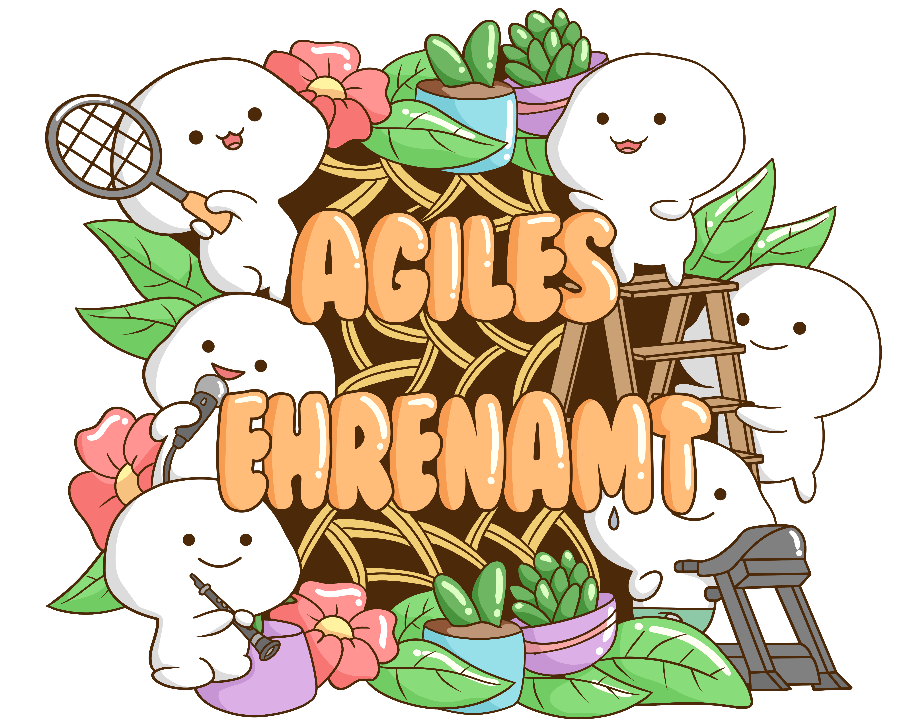

# Agiles Ehrenamt



[](#contributors)


Die Seite ist mit [Docusaurus](https://docusaurus.io/) erstellt.

Änderungen sind jederzeit willkommen. Dazu bitte das Repository forken und einen Pull Request erstellen. 

### Installation der Abhängigkeiten

```shell
npm install
```

### Lokales Entwicklen

```shell
npm start
```

Dieser Befehl startet einen lokalen Entwicklungsserver und öffnet ein Browserfenster. Die meisten Änderungen werden live
übernommen, ohne dass der Server neu gestartet werden muss.

### Build

```shell
npm run build
```

Dieser Befehl generiert statische Inhalte in das Verzeichnis `build`.

### Deployment

Eine GitHub Action baut automatisch ein Docker Image mit dem Namen `ghcr.io/d135-1r43/agiles-ehrenamt:latest` auf Basis
von NGINX. Um lokal zu bauen, kann folgende Abfolge von Befehlen verwendet werden:

````shell
npm run build
docker compose build
````

## Contributors

<!-- ALL-CONTRIBUTORS-LIST:START - Do not remove or modify this section -->
<!-- prettier-ignore-start -->
<!-- markdownlint-disable -->

<!-- markdownlint-restore -->
<!-- prettier-ignore-end -->

<!-- ALL-CONTRIBUTORS-LIST:END -->